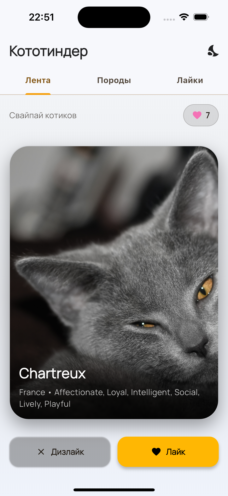
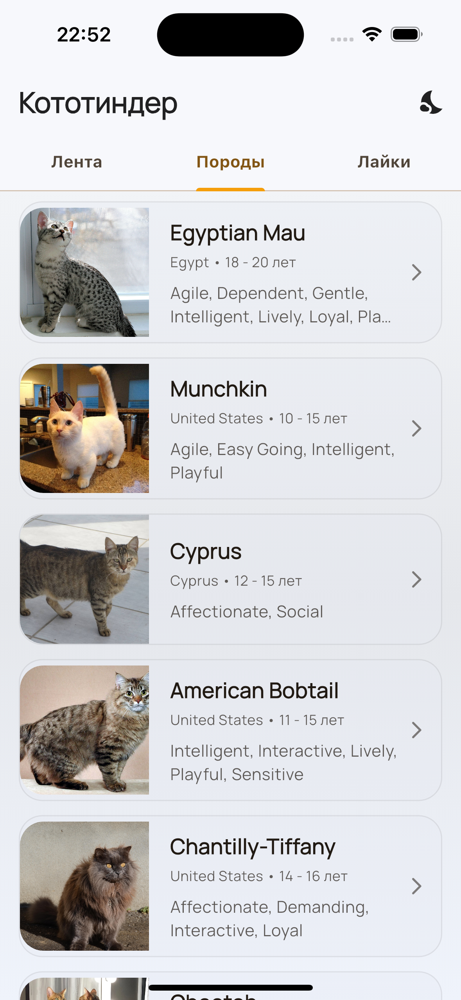
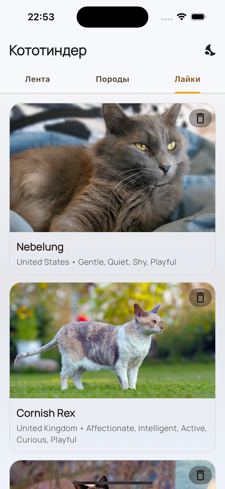
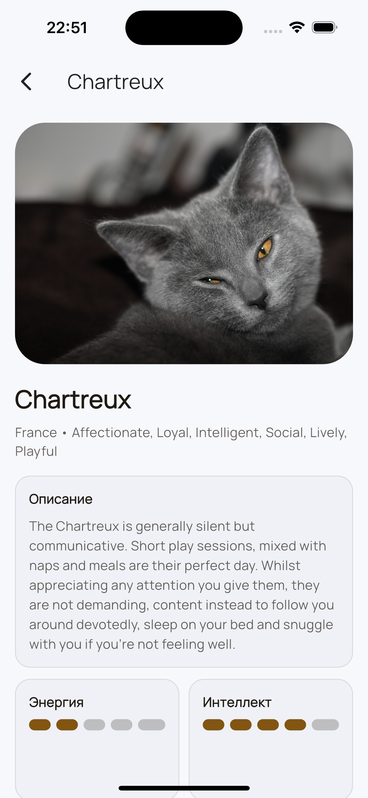
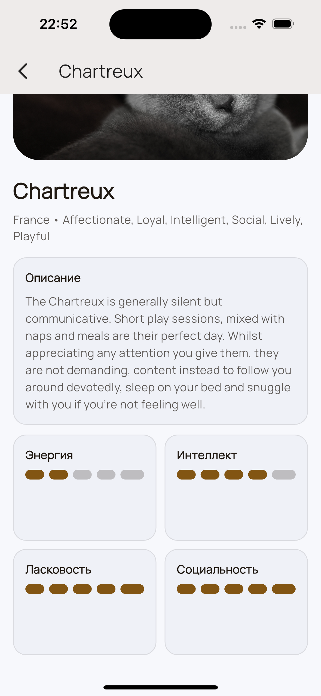
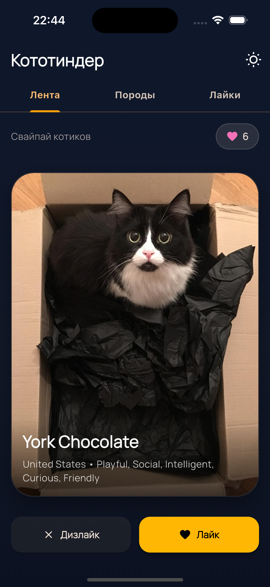
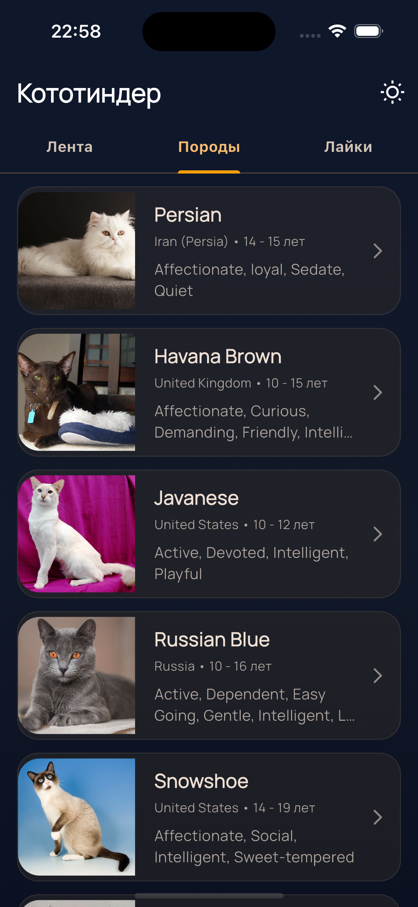
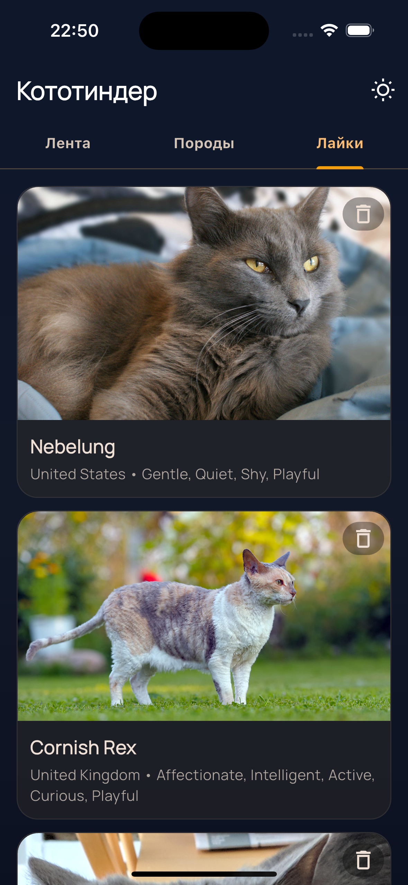
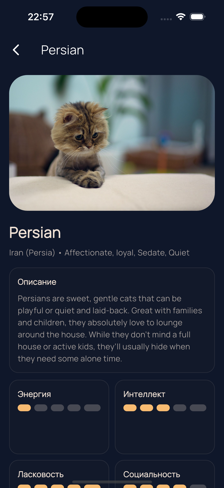
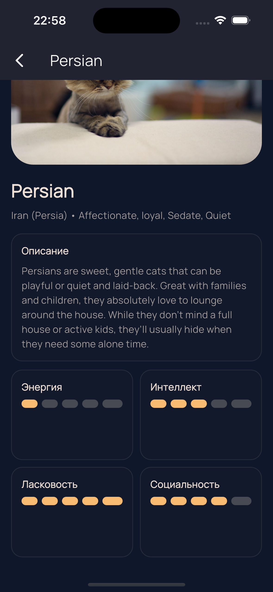

# Кототиндер 🐱

Приложение на Flutter для свайпа котиков с TheCatAPI: лайкай, дизлайкай, смотри описание породы и сохраняй понравившихся.

## Что внутри (фичи)
- 📲 Свайпы карточек с анимацией, визуализацией лайка/дизлайка.
- ❤️ Лайки сохраняются между перезапусками (SharedPreferences), из списка лайков можно удалять котов.
- 🔍 Экран пород и детальные карточки пород.
- ℹ️ Экран подробной информации о котике с Hero-анимациями.
- 🎨 Светлая/тёмная тема с переключателем в AppBar.

## Установка и запуск
```bash
flutter pub get
flutter run -d <device_id>
```

## APK
- Актуальная сборка: `build/app/outputs/flutter-apk/app-release.apk`

## Скриншоты - светлая тема






## Скриншоты - тёмная тема






## Архитектура и структура
- `lib/app.dart` — MaterialApp, тема.
- `lib/features/cats/models/` — модели `CatImage`, `Breed`.
- `lib/features/cats/data/` — `CatApiService` (HTTP), `LikesStorage` (SharedPreferences).
- `lib/features/cats/presentation/`
  - `home/` — `CatHomePage` с табами.
  - `swipe/` — лента свайпов и карточка.
  - `breeds/` — список пород.
  - `liked/` — список лайкнутых.
  - `detail/` — экраны деталей кота и породы.
  - `widgets/` — градиент фона, карточки секций.

## API
- TheCatAPI: `https://api.thecatapi.com/v1`
  - случайный кот с породой: `/images/search?has_breeds=1`
  - список пород: `/breeds`
  - кот по породе: `/images/search?breed_ids={id}&limit=1`

## Полезные команды
- Анализ: `flutter analyze`
- Сборка релиза APK: `JAVA_HOME=$(/usr/libexec/java_home -v 23.0.1) flutter build apk --release`
