# Кототиндер

Flutter-приложение для свайпа котиков с TheCatAPI. В проекте есть основной flow с лентой, породами и лайками, а также онбординг, авторизация через Firebase, регистрация с анкетой пользователя и редактируемый профиль.

## Реализованные фичи
- Лента с карточкой кота: лайк/дизлайк кнопками и свайпом.
- Переход в детали кота по тапу на карточку.
- Экран пород с переходом в детали породы.
- Экран лайков с удалением и переходом в детали.
- По умолчанию тема приложения подстраивается под системную тему устройства.
- Пользователь может вручную выбрать светлую, темную или системную тему.
- Онбординг (pager + анимации) при первом запуске.
- Регистрация и вход через Firebase Auth.
- Валидация полей входа/регистрации.
- Регистрация с заполнением анкеты пользователя: фото, описание, энергия, интеллект, ласковость, социальность.
- Сохранение состояния авторизации между перезапусками.
- Экран профиля пользователя из главного flow.
- Редактирование анкеты пользователя: фото, описание, энергия, интеллект, ласковость, социальность.
- Выход из аккаунта с экрана профиля.
- Удаленное хранение анкеты пользователя в Firebase:
  - Cloud Firestore для текстовых полей и характеристик
  - Firebase Storage для фото профиля
- Логирование событий в Firebase Analytics:
  - `auth_sign_in` (`success`/`failure`)
  - `auth_sign_up` (`success`/`failure`)
  - `cat_action_button_tap` (`action=like|dislike`)
  - `cat_reaction` (`action=like|dislike`, `trigger=button|swipe`)
  - `cat_detail_open` (`source=swipe_feed|liked_list`)
  - `liked_cat_remove` (`source=button|swipe`)
  - Для событий по котикам отправляются параметры контекста: `cat_id`, `breed_id`, `breed_name`, `origin`, `energy_level`, `intelligence`, `affection_level`, `social_needs`, `likes_count_before`, `likes_count_after`

## Архитектура
Проект разложен по слоям `Data / Domain / Presentation` в рамках feature-модулей:
- `lib/features/auth/`
- `lib/features/cats/`
- `lib/features/onboarding/`

Ключевые принципы:
- UI зависит от domain-абстракций/use-cases.
- Data реализует интерфейсы domain-слоя.
- Централизованная сборка зависимостей в композиционном корне:
  - `lib/core/di/app_dependencies.dart`

## Firebase конфигурация
- iOS: `ios/GoogleService-Info.plist`
- Android: `android/app/google-services.json`
- Инициализация Firebase идет через нативные конфиги платформ (`Firebase.initializeApp()` без хранения ключей в `lib/`)
- Профиль пользователя хранится в Cloud Firestore (`user_profiles/{uid}`)
- Фото профиля хранится удаленно. Основной путь: Firebase Storage (`user_profiles/{uid}/avatar_*`).
- Для совместимости предусмотрен резервный удаленный формат хранения фото в Firestore, если клиент не может получить download URL сразу после загрузки.
- Аналитика отправляется в Firebase Analytics для auth-сценариев и действий в ленте котиков.

## Тесты
Покрытие требований:
- Unit-тесты доменной логики auth:
  - `test/features/auth/domain/auth_credentials_validator_test.dart`
  - `test/features/auth/domain/sign_in_use_case_test.dart`
  - `test/features/auth/domain/sign_up_use_case_test.dart`
- Widget-тесты auth-сценариев:
  - `test/features/auth/presentation/auth_flow_widget_test.dart`
  - `test/features/auth/presentation/sign_up_page_widget_test.dart`
- Widget-тесты пользовательских действий в экранах котиков:
  - `test/features/cats/presentation/cat_swipe_page_widget_test.dart`
  - `test/features/cats/presentation/liked_cats_page_widget_test.dart`

Запуск:
```bash
flutter analyze
flutter test
```

## CI/CD
Добавлен GitHub Actions workflow:
- `.github/workflows/flutter_ci.yml`

На каждый `push` и `pull_request` workflow запускает:
1. `flutter pub get`
2. `flutter analyze`
3. `flutter test`

При ошибке анализатора или тестов пайплайн падает.

## APK
Актуальная релизная сборка доступна в GitHub Releases:
- https://github.com/msrychagov/CatsTinder/releases/latest

Локальный файл появляется после сборки:
- `build/app/outputs/flutter-apk/app-release.apk`

Сборка локально:
```bash
flutter build apk --release
```

## Скриншоты
### Темная тема
Запись экрана:
- [Темная тема](docs/screenshots/dark/screenRecordDark.mp4)

Онбординг:

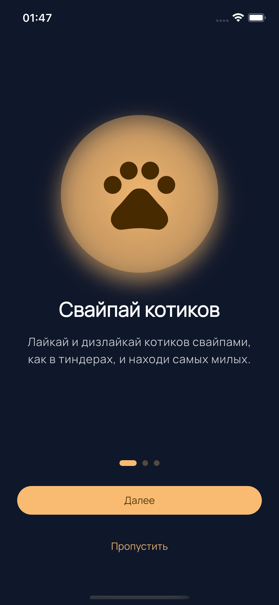
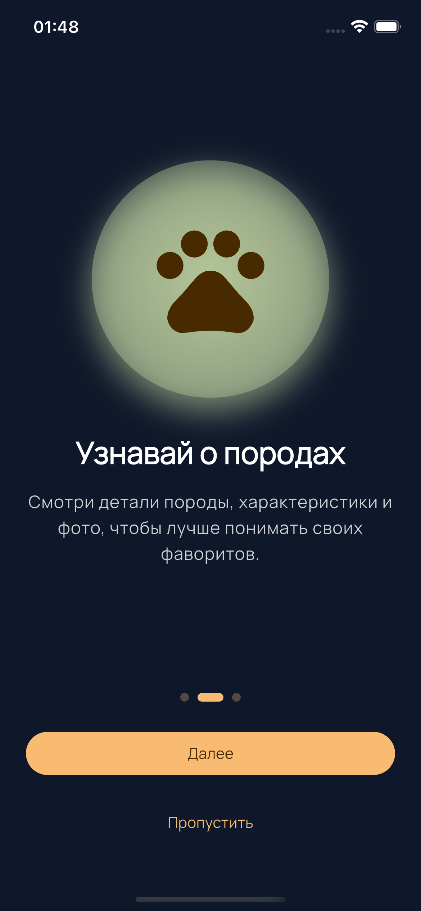
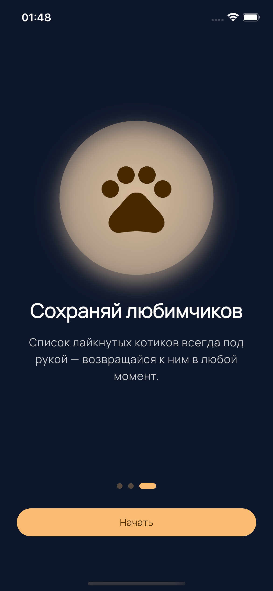

Авторизация:

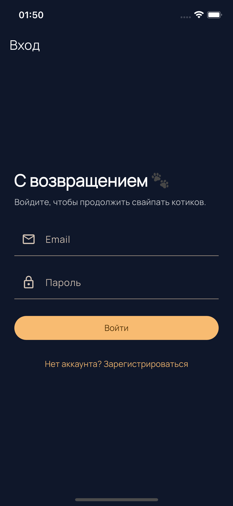
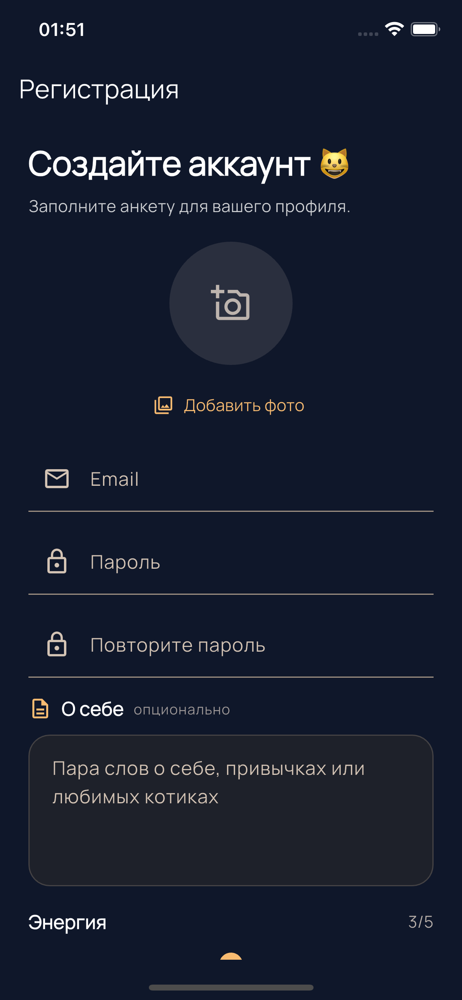
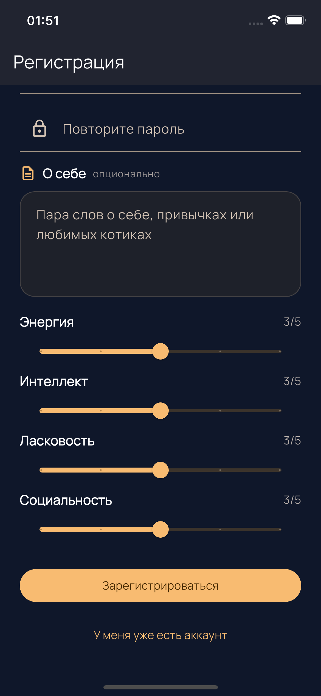

Основной flow:

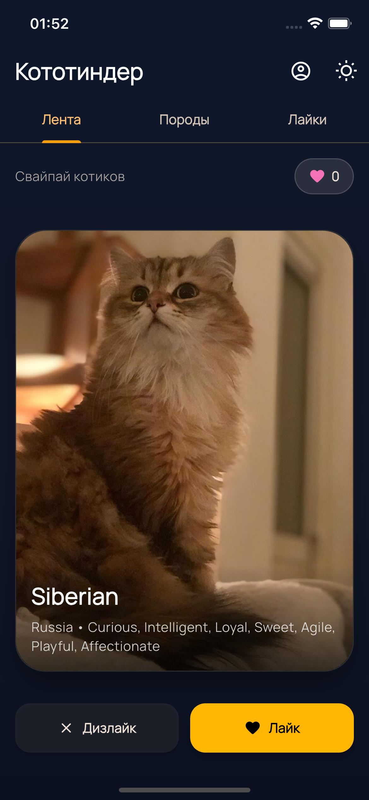


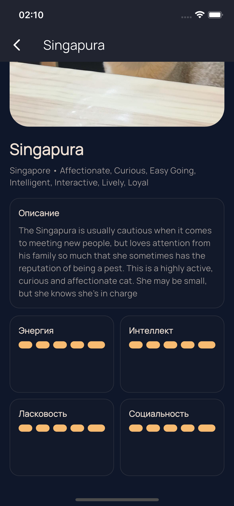

Профиль:

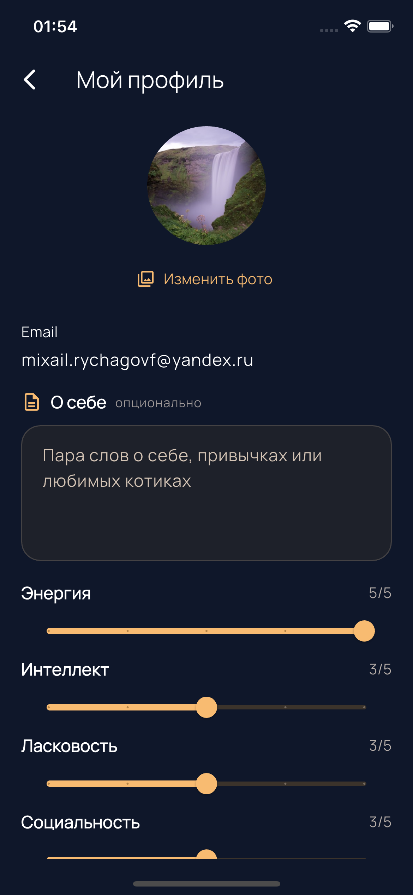
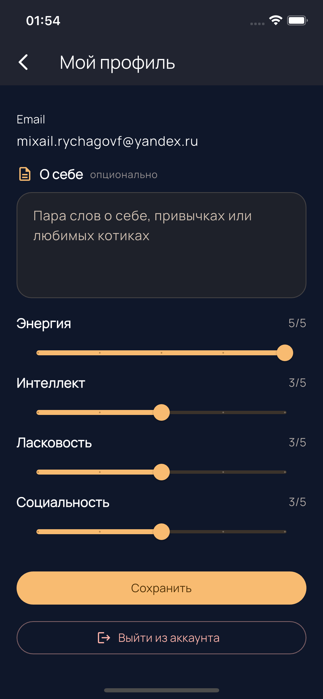

### Светлая тема
Запись экрана:
- [Светлая тема](docs/screenshots/light/screenRecordLight.mp4)

Онбординг:

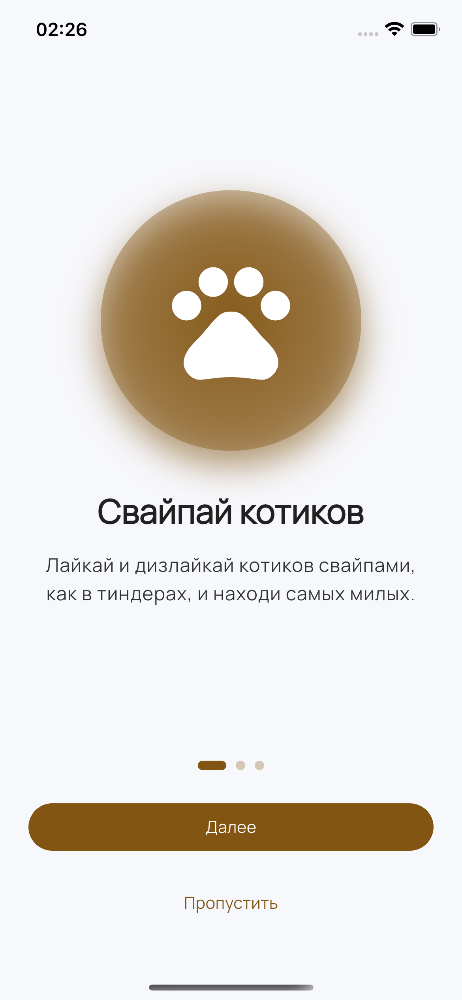
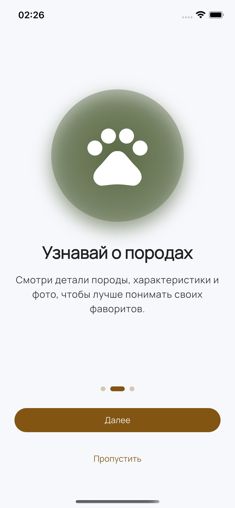
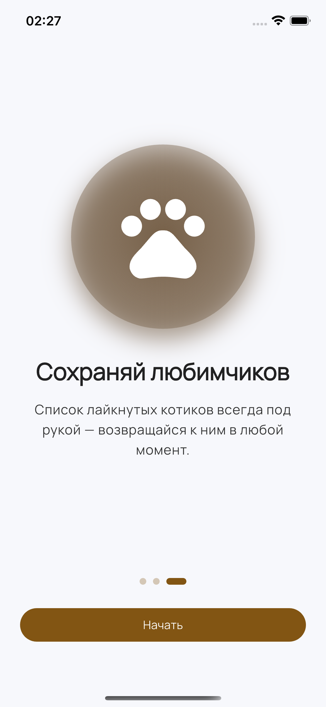

Авторизация:

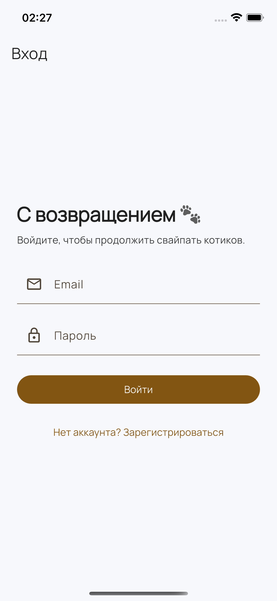
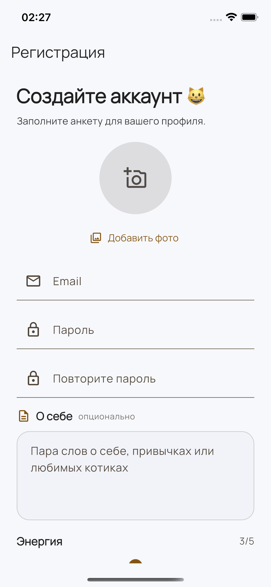
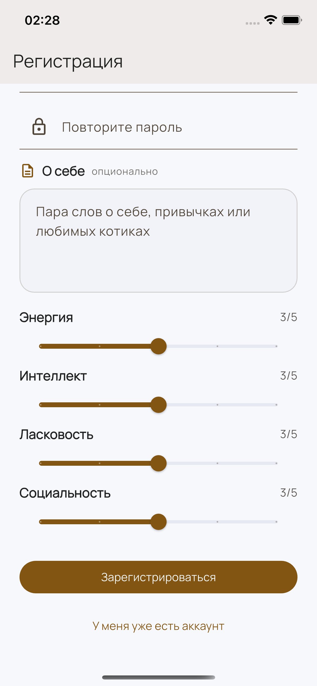

Основной flow:

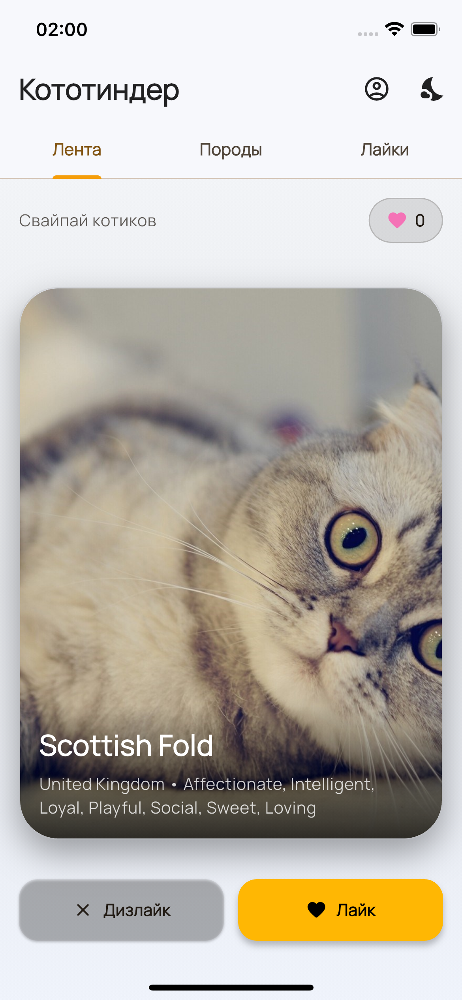


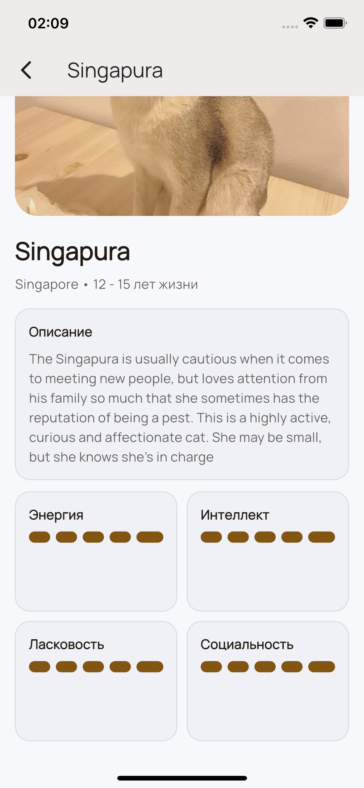

Профиль:

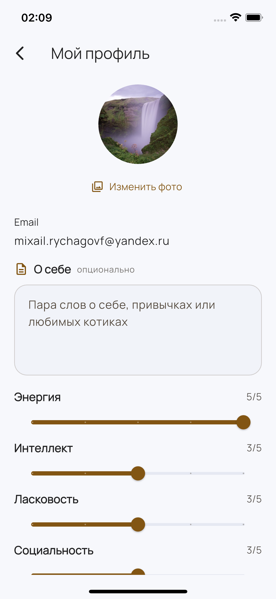
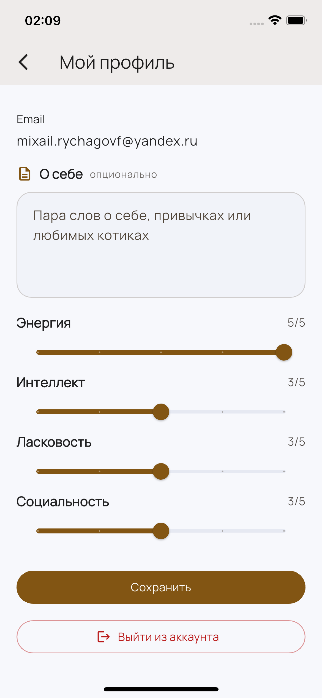

### Firebase Analytics
Реальные события в консоли Firebase:

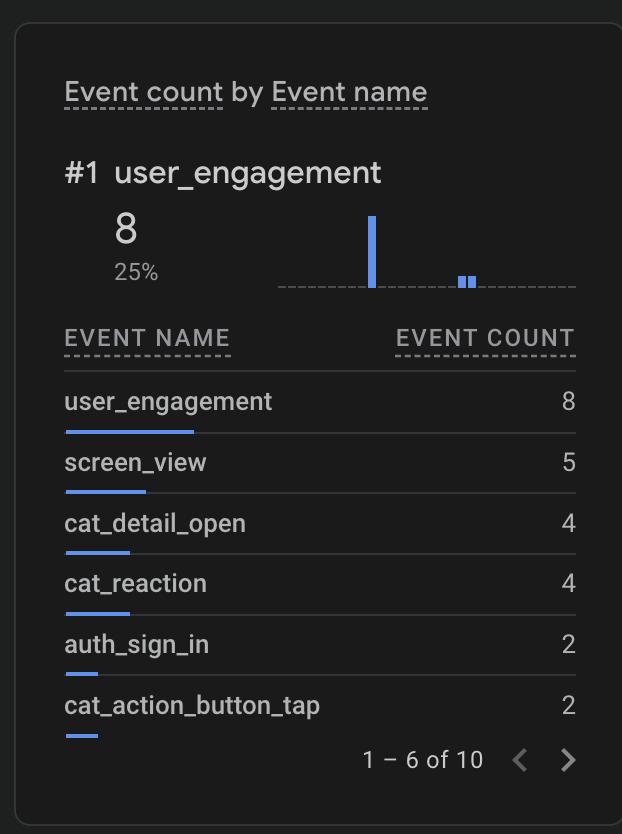
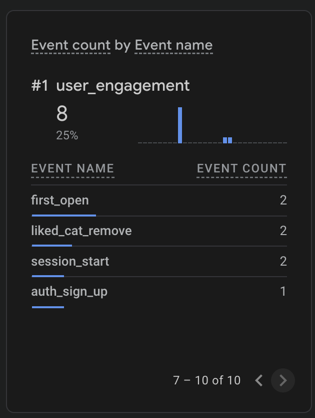

Примечание:
- При первом запуске приложение использует системную тему устройства, но пользователь может в любой момент вручную переключить тему на светлую, темную или снова системную.
- Онбординг и экраны авторизации следуют системной теме устройства. В репозитории они сохранены в темной теме, потому что скриншоты были сделаны на устройстве с темной системной темой.

## Запуск проекта
```bash
flutter pub get
flutter run
```
